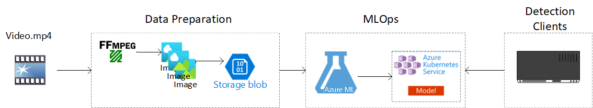

# Oceanic Whitetip Shark Conservation using Azure ML

## Overview

**OWTSHARKS** project aims to develop a machine learning algorithm and shark detection model to quickly detect oceanic whitetip sharks and other species interactions from raw video captured on tuna fishing vessels in near-real time​. ML model is used to analyze the video feed from fishing vessels to ensure proper handling of the endangered species.

## Design
This reference architecture illustrates how to use different Azure services and other tools to build a solution for this project. 




### Operations
At a high level, this project has three operational areas
- **ETL**: Extract the raw video, transform into multiple picture frames and load them into a store for processing. [FFmpeg](https://www.ffmpeg.org/) is used to break the video into individual image frames. These frames will be used as data sets for training the ML models. 
- **MLOps**: Label Data, build, train and deploy ML models. We used automated ML([Auto ML](https://docs.microsoft.com/en-us/azure/machine-learning/concept-automated-ml)) for Object Detection in Images within Azure Machine Learning. Auto ML is a process of automating the time-consuming, iterative tasks of machine learning model development. A data labeling project in Azure ML is used to label sharks 
and its position in every image contained in the data store. This labeling tool rapidly prepares the data for a ML project. All these ML Ops can be performed via Azure Machine Learning studio at  https://ml.azure.com, a consolidated web interface that includes machine learning tools to perform data science scenarios for data science practitioners of all skill levels.
- **Detections**: Deploy the model as a web service that can be used to predict the images. On the client side, the video from a camera feed can be converted to image frames using [FFmpeg]((https://www.ffmpeg.org/)). For each of these image frames, the ML model web service is invoked to detect sharks and its position. A simple HTML/CSS/Javascript based media player can be used to overlay the resultant inference from web service along with the video.

### Components

The above architecture consists of the following Azure components:

[Azure Blob Storage](https://docs.microsoft.com/en-us/azure/storage/blobs/storage-blobs-introduction) is used to store all the image frames that were extracted from the videos. Azure Machine Learning integrates with Blob storage so that users do not have to manually move data across compute platforms and blob storages. Blob storage is also cost-effective for the performance that this workload requires.

[Azure Kubernetes Service](https://docs.microsoft.com/en-us/azure/aks/intro-kubernetes) (AKS). AKS is used to deploy and operationalize a machine learning model service API on a Kubernetes cluster. AKS hosts the containerized model, providing scalability that meets your throughput requirements, identity and access management, and logging and health monitoring.

[Azure Machine Learning](https://docs.microsoft.com/en-us/azure/machine-learning/) is used to build, train, deploy, and manage ML models in a cloud-based environment. This service is used to track and manage machine learning models, and then package and deploy these models to a scalable AKS environment. In addition, it also offers a managed compute target called Azure Machine Learning Compute for training, deploying, and scoring machine learning models.

### Performance considerations
For these kind of deep learning workloads where image processing is involved, GPUs will generally out-perform CPUs by a considerable amount. We recommend using the latest [NCv3 series](https://docs.microsoft.com/en-us/azure/virtual-machines/sizes-gpu) of GPU optimized compute for both training and inference. 

### Cost considerations
Compared to the storage components, the compute resources used in this architecture by far dominate in terms of costs as it uses GPU-enabled machines.

The Azure Machine Learning Compute cluster size can automatically scale up and down depending on the jobs in the queue. You can enable autoscale programmatically by setting the minimum and maximum nodes.

Another driver of cost is AKS cluster size which should be set to meet the performance requirements on the detection end. The AKS costs are tied to the throughput and performance required by the client site that invokes it and will scale up and down depending on the volume of traffic to the API.

## Deploy the solution
To deploy the above reference architecture, follow the below steps. 

### Prerequisites
- An Azure subscription. 
- A Machine Learning workspace. See [Create an Azure Machine Learning workspace](https://docs.microsoft.com/en-us/azure/machine-learning/how-to-manage-workspace). This automatically creates storage resources like Azure blob storage that can be used as a data store for the image frames.
- [FFmpeg] (https://www.ffmpeg.org/)
- Media Player - A simple HTML/CSS/Javascript based media player that can play MP4 files and overlay the metadata along with the video.

### Extract & Load the image frames from the video
Use [FFmpeg] (https://www.ffmpeg.org/) to break the image to frames and use [AzCopy](https://docs.microsoft.com/en-us/azure/storage/common/storage-ref-azcopy) or [Azure Storage Explorer](https://docs.microsoft.com/en-us/azure/vs-azure-tools-storage-explorer-blobs) to upload the image frames to the blob storage account.

### Image Labeling
For this project we have used the following labels to identify the sharks and its position
- Shark Water
- Shark Water Fin
- Shark Deck
- Shark Deck Fin

With these labels, create a data labeling project of task type ```Object Identification (Bounding Box)``` and add labels to all the images that were uploaded to the data store as part of the previous step. Use the steps outlined in [Create an image labeling project and export labels](https://docs.microsoft.com/en-us/azure/machine-learning/how-to-create-image-labeling-projects) to create a data labeling project and add labels. 

### Create Datasets with labels
When you complete a data labeling project, you can export the label data from a labeling project. Doing so, allows you to capture both the reference to the data and its labels, and export them as an Azure Machine Learning dataset. Use the **Export** button on the **Project details** page of your labeling project. Use [Create and explore Azure Machine Learning dataset with labels](https://docs.microsoft.com/en-us/azure/machine-learning/how-to-use-labeled-dataset) to find steps to export the data set with labels

### Train an Object Detection model using AutoML
Once we have the training data set with labels, we can use AutoML for training an object detection model. Please follow the steps outlined in the [GitHub repo](https://github.com/Azure/azureml-examples/blob/main/python-sdk/tutorials/automl-with-azureml/image-object-detection/auto-ml-image-object-detection.ipynb) to create the model and deploy to AKS. Once deployed, you will have an API with a key that can be used for inference. 

> In the above notebook, the example data set can be replaced with the actual shark data set that was created as part of a data labelling project in the previous step.

### Detection and Visualization
The previous step deploys a web service to predict new images. Given a video, we use the same [FFmpeg](https://www.ffmpeg.org/) tool to extract the image frames and invoke the web service for each image. The web service returns the bounding boxes for the input image and these can be visualized on any client. The client can be a media player that can overlay the resultant metadata along with the video for visualization.

### Export the model to host on the edge
The ML model can also be exported and can be hosted on the edge for local inference to speed up the detection. Please refer to [Local Inference using ONNX](https://docs.microsoft.com/en-us/azure/machine-learning/how-to-inference-onnx-automl-image-models?tabs=multi-class)


 


